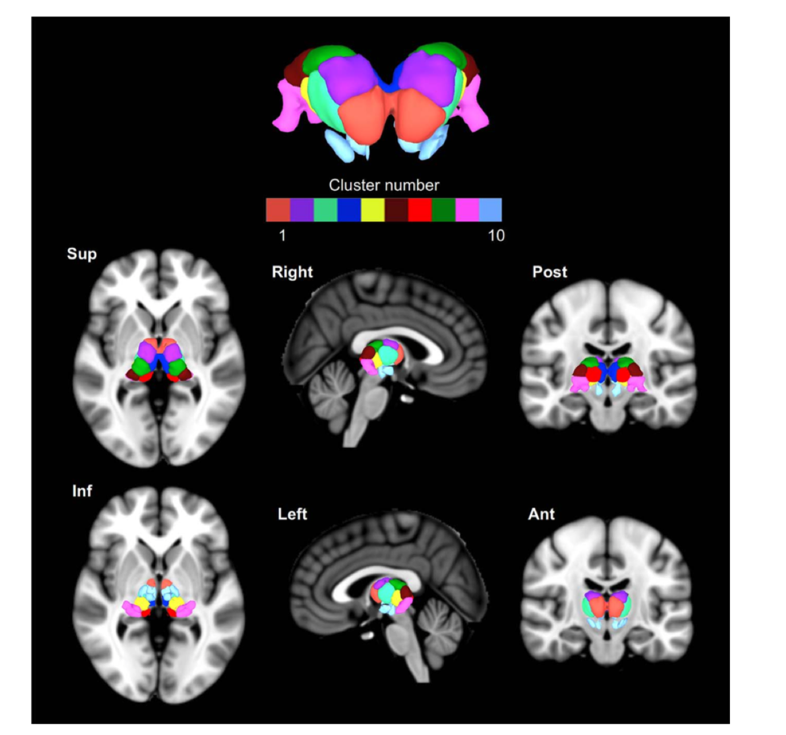
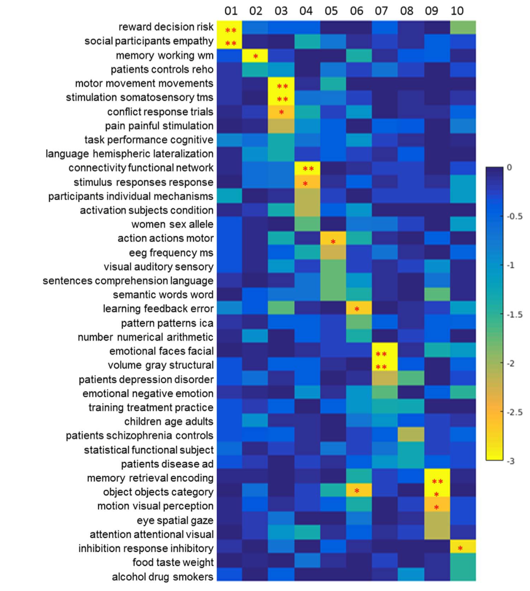

# MAPBOT
MAPBOT: Meta-analytic parcellation based on text 

The paper can be found: https://doi.org/10.1016/j.neuroimage.2017.06.032

The dataset is based on Neurosynth

AFNI matlab read/write package is needed.

The Neurosynth data is transformed into .MAT files

The figure from paper illustrating parcellation of the thalamus:

This demonstrates the related neurosynth topics 

